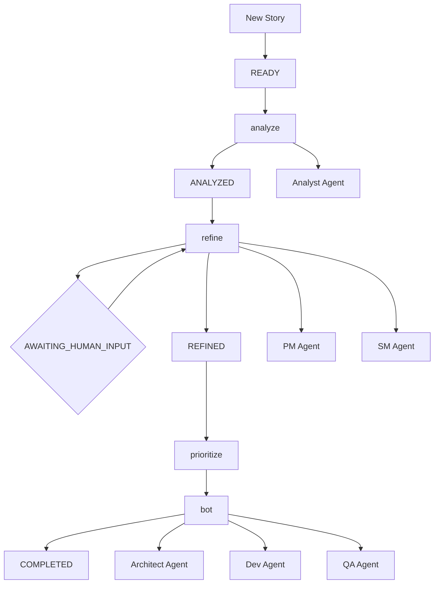

# BMAD Story Orchestrator

A powerful Node.js script that orchestrates the complete BMAD (Business, Management, Architecture, Development) workflow
for agile story management and automated implementation using AI agents.

[](https://opensource.org/licenses/MIT)
[](https://nodejs.org/)

## 🚀 Features

- **Complete BMAD Workflow**: Automated story analysis, refinement, prioritization, and implementation
- **AI Agent Integration**: Leverages specialized BMAD agents (Analyst, PM, SM, Architect, Dev, QA)
- **Concurrent Processing**: Safe multi-instance execution with atomic file locking
- **Process Management**: Automatic cleanup and emergency shutdown protection
- **Workflow State Tracking**: Persistent state management with recovery mechanisms
- **Priority Management**: Intelligent story chunking and prioritization
- **Review System**: Human-in-the-loop clarification system
- **Cost Protection**: Automatic agent process termination to prevent token waste

## 📋 Table of Contents

- [Installation](#installation)
- [Prerequisites](#prerequisites)
- [Quick Start](#quick-start)
- [Workflow Overview](#workflow-overview)
- [Commands](#commands)
- [Configuration](#configuration)
- [Troubleshooting](#troubleshooting)
- [Contributing](#contributing)
- [License](#license)

## 🔧 Installation

### Prerequisites

- **Node.js**: Version 16.0.0 or higher
- **cursor-agent**: Must be available in PATH
- **BMAD Rules**: Required `.cursor/rules/bmad/` directory with agent configurations:
  - `analyst.mdc`
  - `pm.mdc`
  - `sm.mdc`
  - `architect.mdc`
  - `dev.mdc`
  - `qa.mdc`

### Setup

1. **Clone or download the script**:

   ```bash
   curl -O https://raw.githubusercontent.com/your-repo/bmad-story-orchestrator.js
   chmod +x bmad-story-orchestrator.js
   ```

2. **Verify cursor-agent installation**:

   ```bash
   which cursor-agent
   ```

3. **Set up BMAD rules directory**:
   ```bash
   mkdir -p .cursor/rules/bmad/
   # Copy your BMAD agent configurations here
   ```

## 🚀 Quick Start

### Basic Usage

```bash
# Check current status
node bmad-story-orchestrator.js status

# Initialize and analyze new stories
node bmad-story-orchestrator.js analyze

# Process stories through PM review and SM splitting
node bmad-story-orchestrator.js refine

# Create priority ordering
node bmad-story-orchestrator.js prioritize

# Implement prioritized stories
node bmad-story-orchestrator.js bot
```

### Complete Workflow Example

```bash
# 1. Analyze all new stories
node bmad-story-orchestrator.js analyze

# 2. Refine stories (PM review + SM splitting)
node bmad-story-orchestrator.js refine

# 3. Create priority ordering
node bmad-story-orchestrator.js prioritize

# 4. Implement stories with full DevOps cycle
node bmad-story-orchestrator.js bot

# 5. Check progress anytime
node bmad-story-orchestrator.js status
```

## 🔄 Workflow Overview

The BMAD Story Orchestrator implements a complete agile development workflow:

### Story States

- **READY**: New story, not yet analyzed
- **ANALYZED**: Technical analysis complete
- **AWAITING_HUMAN_INPUT**: Waiting for clarification from product owner
- **REFINED**: PM approved, SM splitting complete
- **COMPLETED**: Implementation finished and story removed

### Workflow Sequence



### Agent Responsibilities

- **Analyst**: Technical analysis and codebase understanding
- **PM**: Business value assessment and requirements review
- **SM**: Story complexity analysis and splitting
- **Architect**: Solution architecture design
- **Dev**: Implementation with code changes
- **QA**: Quality assurance and testing

## 📖 Commands

### Core Workflow Commands

#### `analyze`

Initialize new stories and analyze READY stories with the Analyst agent.

```bash
node bmad-story-orchestrator.js analyze
```

#### `refine`

Process ANALYZED and AWAITING_HUMAN_INPUT stories through PM review and SM splitting.

```bash
node bmad-story-orchestrator.js refine
```

#### `prioritize`

Create intelligent priority ordering with logical story chunking.

```bash
node bmad-story-orchestrator.js prioritize
```

#### `bot`

Process REFINED stories by priority with Architect→Dev→QA implementation cycles.

```bash
node bmad-story-orchestrator.js bot
```

### Management Commands

#### `status`

Show comprehensive status of all stories and workflow state.

```bash
node bmad-story-orchestrator.js status
```

#### `reset <story-name>`

Reset a specific story to READY state (without .md extension).

```bash
node bmad-story-orchestrator.js reset my-feature-story
```

#### `validate`

Validate and repair workflow state, fix inconsistencies, unstick stories.

```bash
node bmad-story-orchestrator.js validate
```

#### `cleanup`

Kill ALL cursor-agent processes and orchestrator instances, then validate state.

```bash
node bmad-story-orchestrator.js cleanup
```

### Review System

The orchestrator includes a human-in-the-loop review system:

1. **PM Clarification**: PM agent creates `0_REVIEW_{story}.txt` files for business questions
2. **Human Response**: Answer questions in the review file
3. **PM Re-review**: Run `refine` again to process answers
4. **Approval**: PM either approves (proceeds) or requests more info (stays in review)

## ⚙️ Configuration

### Environment Variables

```bash
# AI Model configuration (optional, defaults to grok-code-fast-1)
AI_MODEL=grok-code-fast-1
```

### Directory Structure

```
project/
├── apps/web/stories/           # Story files (.md)
├── .cursor/rules/bmad/         # BMAD agent configurations
├── scripts/
│   └── bmad-story-orchestrator.js
└── .workflow-state.json        # Auto-generated workflow state
```

### Story File Format

Stories should be standard Markdown files with user story format:

```markdown
# Story Title

As a [user type], I want [functionality] so that [benefit].

## Acceptance Criteria

- Criterion 1
- Criterion 2

## Additional Context

Any relevant business or technical context.
```

## 🔧 Troubleshooting

### Common Issues

#### "cursor-agent not found in PATH"

```bash
# Install cursor-agent or add to PATH
export PATH=$PATH:/path/to/cursor-agent
```

#### "BMAD rule missing: analyst.mdc"

```bash
# Ensure BMAD rules are in the correct location
ls -la .cursor/rules/bmad/
```

#### "Another orchestrator instance is already running"

```bash
# Kill existing instances
node bmad-story-orchestrator.js cleanup
```

#### "Story stuck in AWAITING_HUMAN_INPUT"

```bash
# Validate and repair workflow state
node bmad-story-orchestrator.js validate

# Or reset the specific story
node bmad-story-orchestrator.js reset story-name
```

#### "Content loop detected"

The orchestrator automatically prevents infinite content loops. If this occurs:

```bash
# The story file size limit is exceeded
# Reduce story complexity or split manually
```

### Emergency Shutdown

To stop all processes immediately:

```bash
# Send SIGTERM to orchestrator
kill -TERM <orchestrator-pid>

# Or use cleanup command
node bmad-story-orchestrator.js cleanup
```

### Process Monitoring

Monitor active processes:

```bash
# Check for running orchestrator instances
ps aux | grep bmad-story-orchestrator

# Check for active cursor-agent processes
ps aux | grep cursor-agent
```

## 🤝 Contributing

We welcome contributions! Please follow these guidelines:

### Development Setup

1. Fork the repository
2. Create a feature branch
3. Make your changes
4. Test thoroughly
5. Submit a pull request

### Code Standards

- Use modern JavaScript (ES2020+)
- Include comprehensive error handling
- Add JSDoc comments for functions
- Follow existing code style and patterns

### Testing

```bash
# Run the orchestrator with test stories
node bmad-story-orchestrator.js analyze
node bmad-story-orchestrator.js status

# Validate workflow state
node bmad-story-orchestrator.js validate
```

## 🙏 Acknowledgments

- Inspired by agile development practices
- Powered by advanced AI agent orchestration

## 📞 Support

For support and questions:

- Create an issue on GitHub
- Check the troubleshooting section
- Review workflow logs for detailed error information

---

**Happy orchestrating! 🎭✨**
